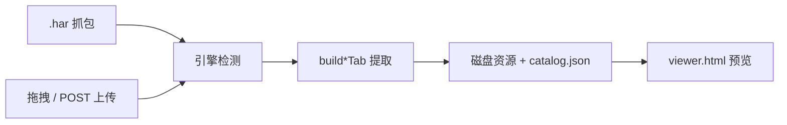

# harExplore · 资源提取与预览技术说明

面向同事的技术分享文档：说明我们如何从游戏 HAR 中离线提取资源，以及 Web 查看器如何预览。  
仓库：[https://github.com/shinjiyu/harExplorer](https://github.com/shinjiyu/harExplorer)

---

## 1. 解决什么问题

抓包得到的 `.har` 里通常混杂了大量运行时资源（贴图、Spine、粒子、字体、音频等）。  
harExplore 做两件事：

1. **离线提取**：从 HAR 还原可独立使用的资源包（带清晰目录与清单）。
2. **在线预览**：本地 Web 查看器按引擎/游戏分 Tab，直接浏览、播放、导出。

整体流程：




---

## 2. 工程结构


| 目录                               | 职责                                      |
| -------------------------------- | --------------------------------------- |
| `packages/core`                  | 引擎检测、各引擎提取逻辑（共享库）                       |
| `packages/cli`                   | 命令行：catalog 构建、单类资源导出、Spine 转帧          |
| `packages/web`                   | 本地 HTTP + `viewer.html`                 |
| `cocos-projects/particle-player` | Cocos Creator 3.8.8 粒子预览壳（构建后嵌入 viewer） |
| `samples/`                       | 样本 HAR（大体积极大，一般不入仓库）                    |
| `dist/texture-viewer/`           | 构建输出（catalog + 抽出资源）                    |


能力矩阵（按引擎）：


| 能力         | Cocos 3.x | Cocos 2.x | Pragmatic | Slotmill |
| ---------- | --------- | --------- | --------- | -------- |
| 纹理浏览 / 分类  | ✓         | ✓（raw-assets） | ✓ | ✓ |
| Spine 动画预览 | ✓         | ✓（部分）   | —         | —        |
| Spine 转序列帧 | ✓         | ✓（部分）   | —         | —        |
| 位图字体       | ✓         | ✓（部分）   | —         | —        |
| 粒子预览       | ✓         | ✓（plist + raw-assets） | — | — |
| 音频试听       | ✓         | ✓（raw-assets / AudioClip） | — | — |
| Sprite 图集帧  | ✓         | ✓（`__type__` SpriteFrame） | — | — |
| 主版本识别      | ✓         | ✓         | —         | —        |


---


## 3. 引擎识别

入口：`packages/core/src/detect-engine.mjs`

对 HAR 的 `entries` + 页面 title 打分，输出：

```js
{
  engine: 'cocos' | 'pragmatic' | 'slotmill',
  score,
  confident,
  cocosMajor: 2 | 3 | null,       // 仅 engine=cocos
  cocosMajorDetail: { … } | null
}
```

主要信号：

- **URL 模式**
  - Cocos 3.x：`/assets/<bundle>/import|native/`
  - Cocos 2.x：`/res/import/`、`/res/raw-assets/`、`cocos2d-js`
  - 通用：`/import/xx/`；Pragmatic / Slotmill 域名与资源路径特征
- **内容嗅探**：少量 JS/JSON 正文中出现 `cc._RF.push`、`cc.AssetLibrary`（2.x）、`assetManager`（3.x）、`PIXI`、`slotmill` 等。
- **主版本细分**：`detectCocosMajor` 对 2.x / 3.x 再打分，写入 `tab.meta.engine`（如 `Cocos Creator 2.x`）与 `cocosMajor`。
- **Catalog 手工指定**：`packages/web/catalog-sources.json` 里的 `type` 字段可覆盖自动检测。

上传 HAR 时由 `packages/web/server.mjs` 自动检测并选对应 `build*Tab`。

---


## 4. Catalog 与磁盘布局

构建命令：

```bash
npm run build:catalog   # 读 catalog-sources.json → dist/texture-viewer/
npm run serve           # http://127.0.0.1:8765/
```

`catalog.json` 形态（示意）：

```json
{
  "builtAt": "...",
  "tabs": [
    {
      "id": "golden-seth",
      "label": "塞特2",
      "meta": {
        "engine": "Cocos Creator",
        "total": 1234,
        "previewCount": 70,
        "fontCount": 12,
        "particleCount": 6,
        "audioCount": 94
      },
      "textures": [ /* ... */ ],
      "animationManifest": [ /* ... */ ],
      "fontManifest": [ /* ... */ ],
      "particleManifest": [ /* ... */ ],
      "audioManifest": [ /* ... */ ]
    }
  ]
}
```

典型磁盘结构：

```
dist/texture-viewer/
├── catalog.json
├── embedded/<tabId>/          # 抽出的纹理文件
├── animations/<tabId>/        # Spine / 序列帧（Cocos）
├── fonts/<tabId>/             # BitmapFont（Cocos）
├── particles/<tabId>/         # 粒子 plist + 贴图（Cocos）
├── audio/<tabId>/             # AudioClip 音频（Cocos）
├── particle-player/           # 粒子预览 iframe（web-mobile）
├── vendor/                    # Spine 3.8 / 3.7 runtime
├── spine37-player.html
└── spine-bake.js
```

Serve 时：页面/ vendor / 粒子壳来自 `packages/web/viewer/`；数据目录默认指向 `dist/texture-viewer/`。

---


## 5. 各资源类型：提取技术 + 预览技术


### 5.1 纹理（三引擎）

**提取**

- 扫描 HAR `response.content` 中的图片（扩展名 / `image/*` MIME）。
- base64 正文落盘为 `embedded/<tabId>/…`；无法落盘则保留 remote URL。
- Cocos 额外用 import 扫描给纹理打标签：`spine` / `sprite-atlas` / `static` 等。

关键实现：

- Cocos：`packages/core/src/engines/cocos/build-tab.mjs`
- Pragmatic / Slotmill：各自 `engines/*/build-tab.mjs`

**预览**

- Viewer「纹理浏览」：网格 + 分类/格式/资源类型过滤 + 详情面板。
- 已嵌入纹理走相对路径；未嵌入可点原始 URL。

---


### 5.2 Spine / 动画（仅 Cocos）

这是复杂程度最高的一类。

**提取思路**

1. 在 `/import/` JSON 中定位 Spine/`sp.SkeletonData` 相关序列化。
2. 恢复 `skeleton.json` + `.atlas` 文本，并按 atlas 页绑定 `/native/` 贴图：
   - 优先用 SkeletonData 后的贴图 UUID 数组（与 page 顺序对齐）；
   - 否则按 **精确宽高** 匹配，并取 **体积最大** 的候选（同尺寸稀疏 UI 图集常比密 Spine
     页小很多，旧逻辑按小文件优先会把 `symbol.png` 绑到木桌子弹等 UI 页）；
   - **同名 page**（多 skeleton 共用 `symbol.png`）跨 pack 强制共享同一张贴图。
3. 写出标准 Spine 资源包目录，便于在官方播放器里直接加载。

关键文件：

- `packages/core/src/engines/cocos/extract-animations.mjs`
- `packages/core/src/engines/cocos/spine-extract.mjs`

每个 pack 大致包含：

```
animations/<tabId>/<id>/
  skeleton.json
  skeleton.atlas
  <page>.png|webp|…
```

并在 `animationManifest` 中记录：`skelUrl`、`atlasUrl`、`pageUrls`、`spineVersion`、`animationNames` 等。

**预览技术**


| Spine 版本 | 方案                                              | 说明                               |
| -------- | ----------------------------------------------- | -------------------------------- |
| 3.8+     | 官方 `spine-player`（`vendor/spine-player-3.8.js`） | 直接在主页面挂载                         |
| 3.7      | 独立 iframe：`spine37-player.html`                 | 因 runtime 全局冲突，必须隔离第二份全局 `spine` |
| 序列帧      | Canvas 抽帧播放                                     | 来自 Spine 转帧结果或 atlas 序列          |


父子页协议（3.7）：

```js
// 父 → 子
{ type: 'spine37', cmd: 'play' | 'pause' | 'anim' | 'zoom', name?, mode? }
// 子 → 父
{ type: 'spine37', event: 'ready' | 'error', ... }
```

**Spine → 透明 PNG 序列帧（Bake）**

- Viewer 内：`spine-bake.js`（可选多种精度管线：标准、高分辨率、超采样、最近邻、固定画布裁切等）。
- CLI：`npm run bake -- <packDir> --fps 30`  
用 Playwright + 对应版本 Spine runtime 离线渲染，输出 `frame_0000.png…` + `meta.json`。
- `crop-canvas`：保持用户缩放、不缩小适配；画布按轴 clamp 到 maxSize（默认 2048），超出部分从包围盒中心裁掉。`meta.json` 含 `cropped` / `fullWidth` / `fullHeight`。

独立导出：

```bash
npm run spine -- <file.har> --names symbol_08 --layout bare --out dist/spine-export
```

---


### 5.3 位图字体 BitmapFont（仅 Cocos）

**提取**

- 识别 import 中的 `cc.BitmapFont` / `fontDefDictionary`。
- 还原 BMFont `.fnt` + 图集贴图。

实现：`packages/core/src/engines/cocos/bitmap-font.mjs`  
输出：`fonts/<tabId>/<id>/<id>.fnt` + 贴图。

**预览**

- Viewer「位图字体」：列表、示例文本 Canvas 渲染、图集预览、`.fnt`/贴图下载。

```bash
npm run font -- <file.har> --name countup_01 --out dist/font-export
```

---


### 5.4 粒子 ParticleSystem2D（仅 Cocos）

粒子参数既可能在 `.plist`（ParticleAsset）里，也可能写在 Prefab 的 `cc.ParticleSystem2D`（`custom=true`）里；贴图走 native UUID。

**提取**

实现：`packages/core/src/engines/cocos/extract-particles.mjs`

```
particles/<tabId>/<id>/
  <id>.plist          # 或 .prefab.json
  texture.png
  meta.json           # 含归一化 params
```

清单字段要点：`plistUrl`、`textureUrl`、`params`、`kind`（`particleAsset` / `particleComponent`）。

**预览技术（真实引擎，而非手写 Canvas 模拟）**

1. Cocos Creator 工程：`cocos-projects/particle-player`
2. 构建 web-mobile → 拷贝到 `packages/web/viewer/particle-player/`
3. Viewer iframe 加载该壳；宿主脚本 `ParticlePlayerHost.ts` 收 `postMessage`

协议：

```js
// 父 → 子
{ type: 'particle', cmd: 'load', plistUrl?, textureUrl?, params?, follow? }
{ type: 'particle', cmd: 'play' | 'pause' | 'restart' | 'follow', enabled? }
// 子 → 父
{ type: 'particle', event: 'ready' | 'loaded' | 'error', message? }
```

实现细节（踩坑后的结论）：

- **不要**把远程 plist 直接塞给 `ParticleSystem2D.file`（`ParticleAsset._nativeAsset` 常为空，触发 `spriteFrameUuid` 空引用）。
- 预览路径采用：**custom 模式 + HAR 已归一化的 params + 贴图 URL**。
- 清空游戏世界坐标 `sourcePos`，默认 **鼠标跟随发射器**（拖尾粒子预览必需）。

```bash
npm run particle -- <file.har> --out dist/har-particles
```

---


### 5.5 音频 AudioClip（仅 Cocos）

**提取**

实现：`packages/core/src/engines/cocos/extract-audio.mjs`

- Import JSON：`cc.AudioClip` → `_name` / `_native` / `_duration`
- Native：`/native/<ab>/<uuid>.mp3` 等二进制

输出：

```
audio/<tabId>/<id>/<id>.mp3
audio/<tabId>/manifest.json
```

**预览**

- Viewer「音频」：列表（体积/时长排序）+ HTML5 `<audio controls>` 试听 + 单条/批量下载。
- 服务端补充 MIME：`.mp3` / `.ogg` / `.wav` / `.m4a`（`packages/web/server.mjs`）。

```bash
npm run audio -- <file.har> --out dist/har-audio
```

---


## 6. Viewer 交互总览

入口页面：`packages/web/viewer/viewer.html`

Mode Tabs：


| Tab  | 数据来源                                                 | 预览载体                               |
| ---- | ---------------------------------------------------- | ---------------------------------- |
| 纹理浏览 | `textures[]`                                         | 图片网格                               |
| 动画预览 | `animationManifest` / `animations/.../manifest.json` | Spine Player / 3.7 iframe / Canvas |
| 位图字体 | `fontManifest`                                       | Canvas + 图集                        |
| 粒子预览 | `particleManifest`                                   | Cocos iframe                       |
| 音频   | `audioManifest`                                      | `<audio>`                          |


也可直接拖拽 HAR 到页面 → `POST /upload` → 自动识别引擎并追加 Tab。

---


## 7. CLI 速查

```bash
# 多 HAR catalog（给 Viewer 用）
npm run build:catalog

# 启动查看器
npm run serve

# 单类导出
npm run spine   -- <har> --names <name> --out dist/spine-export
npm run font    -- <har> --name <fontName> --out dist/font-export
npm run particle -- <har> --out dist/har-particles
npm run audio   -- <har> --out dist/har-audio

# Spine 转透明序列帧
npm run bake -- <packDir> --fps 30 --pipeline standard
# 不适配：超出画布裁切（保持 1:1 缩放）
npm run bake -- <packDir> --fps 30 --scale 1 --pipeline crop-canvas

# Windows 绿色包
npm run pack        # 内置 Node + 预置雷神2/塞特2
npm run pack:full   # 额外含 Playwright 烘焙环境
```

环境要求：Node.js ≥ 18；bake 依赖 Playwright。

---


## 8. 关键设计取舍（分享时可重点讲）

1. **HAR 是事实来源**：不依赖游戏源工程，适合外发包 / 竞品分析场景。
2. **预览优先用「真实 runtime」**：Spine 用官方播放器；粒子用 Cocos 真机组件，减少「手写模拟器对不齐」的成本。
3. **隔离 iframe**：Spine 3.7 与 3.8 runtime 不能共处同一全局；粒子壳也是完整 web-mobile，同样放入 iframe。
4. **Catalog + 磁盘双写**：Viewer 既可读 tab 内联清单，也能 fetch `*/manifest.json`，上传新建 Tab 与静态托管都好接。
5. **Cocos 优先深化**：字体 / 粒子 / 音频序列化格式高度引擎相关；Pragmatic、Slotmill 目前聚焦纹理链路。

---


## 9. 关键源码索引


| 主题           | 路径                                                                           |
| ------------ | ---------------------------------------------------------------------------- |
| 引擎检测         | `packages/core/src/detect-engine.mjs`                                        |
| Cocos 总入口    | `packages/core/src/engines/cocos/build-tab.mjs`                              |
| Spine 提取     | `…/cocos/spine-extract.mjs`, `extract-animations.mjs`                        |
| 位图字体         | `…/cocos/bitmap-font.mjs`                                                    |
| 粒子提取         | `…/cocos/extract-particles.mjs`                                              |
| 音频提取         | `…/cocos/extract-audio.mjs`                                                  |
| Catalog 构建   | `packages/cli/src/build-texture-viewer-catalog.mjs`                          |
| HTTP + 上传    | `packages/web/server.mjs`                                                    |
| 查看器 UI       | `packages/web/viewer/viewer.html`                                            |
| Spine 3.7 子页 | `packages/web/viewer/spine37-player.html`                                    |
| Bake         | `packages/web/viewer/spine-bake.js` / `packages/cli/src/spine-to-frames.mjs` |
| 粒子壳工程        | `cocos-projects/particle-player/`                                            |
| 粒子 Host      | `…/assets/scripts/ParticlePlayerHost.ts`                                     |
| 绿色包脚本        | `scripts/pack-portable-win.mjs`                                              |


---


## 10. 本地最快上手

```bash
# 准备样本 HAR
copy D:\path\to\play.godeebxp.com.har samples\

# 构建并启动
npm run build:catalog
npm run serve
# 浏览器打开 http://127.0.0.1:8765/
```

或直接使用绿色版：`release/harExplore-portable-win-x64.zip` → 解压 → **启动查看器.bat**。